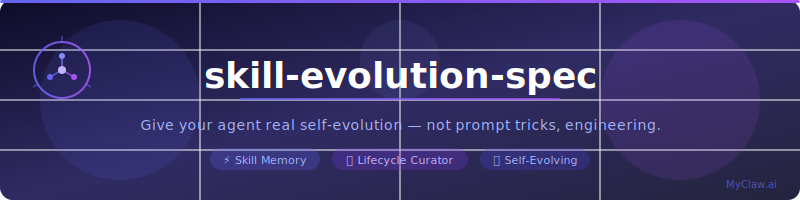

<div align="center">



<br/>

[](LICENSE)
[](https://myclaw.ai)
[](https://myclaw.ai)
[]()
[](CONTRIBUTING.md)
[]()

**Languages:** [English](README.md) · [中文](README.zh-CN.md) · [日本語](README.ja.md) · [한국어](README.ko.md) · [Français](README.fr.md) · [Deutsch](README.de.md) · [Español](README.es.md) · [Русский](README.ru.md)

</div>

---

## What is this?

Most AI agents are stateless tools. They forget everything after each session. This spec describes a **skill evolution system** that gives agents:

- **Persistent skill memory** — learned procedures survive across sessions
- **Usage telemetry** — the agent knows which skills it actually uses
- **Lifecycle governance (Curator)** — auto-archives dead skills, prevents skill rot
- **Token-efficient loading** — only injects one-line summaries into context, loads full content on demand

> "The bottleneck isn't intelligence. It's discipline engineering." — §8 of the spec

---

## The Four Pillars

| Pillar | What it does |
|--------|-------------|
| **Skill files** | Plain-text `SKILL.md` files on disk — readable, versionable, backupable |
| **R/W tools** | `skill_view`, `skill_manage`, `skills_list` — "learning" = writing files |
| **System prompt discipline** | Hard rules on when to store, when to update — agent actually maintains skills |
| **Curator** | Background governance: dedup, archive, prune — prevents skill library from rotting |

---

## File Structure

```
$CLAW_HOME/skills/
├── <category>/
│   └── <skill-name>/
│       ├── SKILL.md              # Main file (required)
│       ├── references/           # Load on demand
│       ├── templates/
│       └── scripts/
├── .usage.json                   # Usage telemetry sidecar
├── .curator_state                # Curator scheduler state
└── .skills_prompt_snapshot.json  # Prompt snapshot cache
```

---

## SKILL.md Format

```markdown
---
name: deploy-netlify
description: "One sentence: when to trigger and what it does"
version: 1.0.0
created_by: agent
tags: [deploy, netlify, static]
---

# Skill Title

## When to Use (Trigger Conditions)

## Steps
1. Numbered steps with exact commands

## Pitfalls
- Known failure modes

## Verification
- How to confirm success
```

The `created_by: agent` field is the foundation of the governance system. Only agent-created skills are touched by the Curator. Built-in and hub-installed skills are always exempt.

---

## Token-Efficient Loading (the scaling key)

**Wrong approach:** inject all skill content into the system prompt → context explodes as skills grow.

**Right approach:**
1. System prompt only gets a one-line manifest: `name: description` per skill
2. Full content is never in the system prompt
3. Agent calls `skill_view(name)` when relevant → loads on demand
4. A snapshot cache avoids re-parsing all `SKILL.md` files on cold start

---

## Curator — Lifecycle Governance

The part most implementations skip. Without it, the skill library rots into a garbage dump in 3 months.

**Trigger:** idle-based, not daemon-based. Runs after the agent has been idle for `min_idle_hours`, if more than `interval_hours` have passed since last run.

**State machine:**
```
active ──(stale_after_days)──> stale ──(archive_after_days)──> archived
```

Never deletes. Worst case: `archived`. Always recoverable.

**Defaults:**
```yaml
curator:
  enabled: true
  interval_hours: 168       # weekly
  min_idle_hours: 2
  stale_after_days: 30
  archive_after_days: 90
  backup:
    enabled: true           # tar.gz before every run
```

**Governance scope:** only `is_managed` skills (i.e. `created_by: agent`). Built-ins and hub skills are untouched.

---

## Usage Telemetry (.usage.json)

Every skill gets a record:

```json
{
  "deploy-netlify": {
    "created_by": "agent",
    "use_count": 12,
    "view_count": 30,
    "patch_count": 2,
    "last_used_at": "2026-06-20T10:00:00Z",
    "state": "active",
    "pinned": false
  }
}
```

Three bump events:
- `skill_view` → `bump_view`
- skill actually adopted/executed → `bump_use`
- `skill_manage patch/edit` → `bump_patch`

---

## System Prompt Discipline (§6)

```
## Skills (mandatory)
Scan the skill list below before every reply. If any skill is relevant or partially
relevant, you MUST call skill_view(name) and follow its steps. Better to load and
not need it than to miss a critical step or established process.

After completing a difficult/multi-step task, overcoming an error, or discovering
a non-trivial process, proactively store it with skill_manage(action='create').

If you use a skill and find it outdated or wrong, immediately patch it with
skill_manage(action='patch'). Don't wait to be asked.

<available_skills>
  {category}:
  - {name}: {description}
</available_skills>
```

---

## Implementation Checklist

- [ ] 1. Define SKILL.md format + frontmatter schema (with `created_by` provenance)
- [ ] 2. Directory convention + startup loader (inject description only, not body)
- [ ] 3. Snapshot cache (manifest = mtime_ns + size), reuse on cold start
- [ ] 4. Tools: `skill_view` / `skill_manage` / `skills_list`, all atomic writes
- [ ] 5. Telemetry sidecar `.usage.json` + three bump events (view/use/patch)
- [ ] 6. System prompt discipline (§6 snippet)
- [ ] 7. Curator: idle trigger + state machine + defaults + tar.gz backup + never-delete
- [ ] 8. pin/unpin exemption logic
- [ ] 9. CLI verbs: status / run / pause / resume / pin / unpin / archive / restore / prune / backup / rollback

---

## The Three Things Most Implementations Get Wrong

1. **Token-efficient loading** — skip this and the system breaks at scale (context overflow)
2. **Curator governance** — skip this and the skill library rots in 90 days (self-contamination)
3. **Provenance + never-delete** — skip this and you can't safely automate anything (no recovery path)

> The technical barrier isn't algorithms. It's discipline design.

---

## Full Spec

See [SPEC.md](SPEC.md) for the complete implementation spec with all data schemas, state machines, tool interfaces, and default values.

---

## Built with MyClaw.ai

[](https://myclaw.ai)

This spec was developed and validated as part of the [MyClaw.ai](https://myclaw.ai) agent platform — the only platform where your agent remembers across every session, channel, and device.

**MyClaw.ai** gives agents persistent memory, cross-session goal pursuit, and self-evolving skill libraries — out of the box, no engineering required.

- [myclaw.ai](https://myclaw.ai) — Try it
- [OpenClaw](https://myclaw.ai) — The open agent runtime this spec targets

---

## License

MIT
